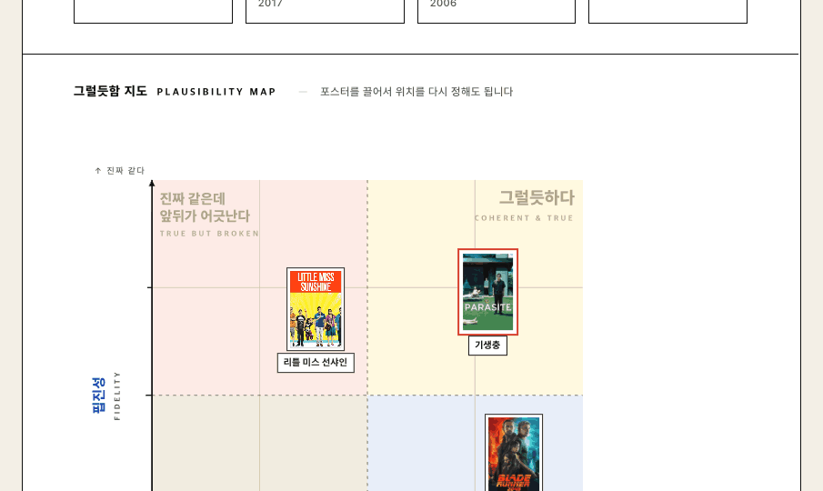
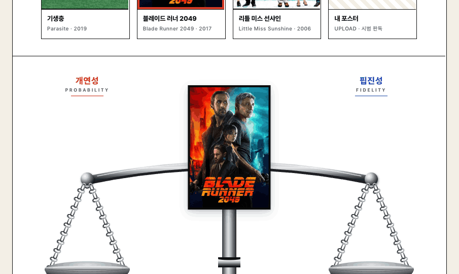

# 이 포스터, 그럴듯한가요?

월터 피셔(Walter Fisher)의 *narrative paradigm* 을 영화 포스터에 적용해 보는 인터랙티브 디자인 실험. 한 장의 포스터를 **개연성(Probability)** 과 **핍진성(Fidelity)** 두 축으로 평가합니다.

같은 분석을 두 가지 메타포로 살펴볼 수 있도록, 디자인 두 벌이 들어 있습니다.

---

## 사분면 지도 — `index.html`

두 축이 직교한다는 사실에 충실한 디자인. 한 포스터는 평면 위의 한 점. 끌어서 다른 사분면으로 옮기거나, 슬라이더로 미세 조정할 수 있습니다.



기생충은 ↑→ *그럴듯하다* 사분면에, 블레이드 러너 2049는 ↓→ *잘 짜였지만 진짜 같지 않다*, 리틀 미스 선샤인은 ↑← *진짜 같은데 앞뒤가 어긋난다* 영역에 놓입니다.

---

## 저울 — `balance-scale.html`

같은 두 축을 좌우 접시 위의 무게로 표현한 메타포 디자인. 시각적으로 직관적이지만, 저울 메타포는 두 축이 *trade-off* 관계라는 인상을 줍니다 — 실제로는 한쪽이 다른 쪽을 만회하지 않습니다.



---

## 개념

**개연성(Probability) — 이야기 안쪽의 논리**
이야기 속 설정·사건·인물의 행동에 모순이 없고, 앞뒤가 똑바로 맞아떨어지는지 판단하는 기준.

**핍진성(Fidelity) — 이야기 바깥의 진실**
그 이야기가 청중이 실제 살아가는 세상의 상식·도덕·인간적 가치관과 부합하여, 진짜처럼 느껴지는지 판단하는 기준.

두 축이 함께 만족될 때 우리는 그 이야기를 *그럴듯하다(verisimilitude)* 고 느낍니다.

---

## 사용

브라우저로 `index.html`을 열면 바로 동작합니다. 외부 의존성은 폰트(Pretendard·Archivo)와 포스터 이미지(TMDB CDN)뿐이고, 모두 인터넷에서 가져옵니다.

업로드한 포스터는 색감 분포·명도 대비·요소 밀도 같은 기본 정보만으로 두 축의 첫 점수를 추정하는 *시범 판독* 입니다. 결과가 마음에 들지 않으면 포스터를 직접 끌어서 자기 판단을 덮어쓰면 됩니다.

---

## 구조

```
.
├── index.html              # 사분면 지도 (메인)
├── balance-scale.html      # 저울 (대안 메타포)
└── screenshots/
    ├── quadrant-map.png
    └── balance-scale.png
```

각 HTML은 단일 파일이며, JS·CSS가 모두 인라인입니다.

---

## 라이선스 / 출처

- 포스터 썸네일: [TMDB](https://www.themoviedb.org/) · 학술/연구 목적 표시
- 폰트: [Pretendard](https://github.com/orioncactus/pretendard) (OFL), [Archivo](https://fonts.google.com/specimen/Archivo) (OFL)
- 이론적 배경: Walter Fisher, *Human Communication as Narration: Toward a Philosophy of Reason, Value, and Action* (1987)
